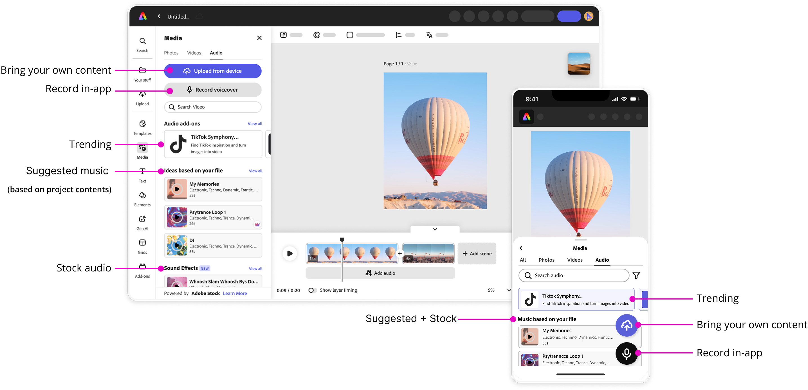

import Container from "../../components/Container.astro";
import StyledHeading from "../../components/StyledHeading.astro";
import Columns from "../../components/Columns.astro";
import StrategyCard from "../../components/StrategyCard.astro";
import H2 from "../../components/CustomUI/H2.astro";
import H3 from "../../components/CustomUI/H3.astro";
import video from '../../assets/images/audio-experience/Captions_5.mp4';
import video2 from '../../assets/images/audio-experience/Captions_6.mp4';
import MdxImage from "../../components/CustomUI/MdxImage.astro";
import Arrow from "../../components/Arrow.astro";
import Captions from "../../components/Captions.astro";

<MdxImage 
  src={import('../../assets/images/audio-experience/adobe-express-app.jpg')} 
  alt="Description"
  class="max-w-5xl mx-auto rounded-md"
/>
<figcaption class="mb-30 text-center italic text-sm text-gray-600 mt-2">
              Adobe Express Desktop and Mobile Editor
            </figcaption>

<Container variant="muted" eyebrow="intent" title="audio editing capabilities for everyone">

  Adobe Express enables non-designers like educators, students, creators, and small businesses to produce high-quality content quickly and easily. Its wide-ranging user base, spanning casual creators to enterprise teams, demanded a solution that balances simplicity with capability.
 
The objective was to design an audio editing experience that integrates intelligent automation and AI-assisted tools, providing accessibility for beginners while maintaining creative control for advanced users.

</Container>

<Container variant="transparent" eyebrow="role"  title="Dream. Define. Execute.">

I joined the team in 2023 as a Design Lead for the Audio Editing experience in Adobe Express. Over two years I collaborated with 3 Product Managers, 2 Engineering teams, 1 Junior Designer, Computer Scientists, and Content team to define the 0-n experience (MVP-scalable patterns) for editing with audio in Express.
 
From working out the product strategy and timeline with the PMs to getting leadership buy-ins through early vision decks, sharing E2E walkthroughs in design crits, collaborating with the design-system teams to define new patterns and delivering final designs to engg. and constantly updating the experience through active user testing.
 
 
This project allowed me to lead the audio design vertical by exploring new paradigms in creation, inventing intuitive editing patterns, and thereby bringing video and audio editing capabilities to a much broader audience.
 

</Container>

<Container variant="muted" eyebrow="design challenge"  title="Audio editing for the masses">

The challenge was to create an audio editing experience that could scale across
skill levels, making editing accessible and intuitive without compromising
creative control. Additional constraints included integrating AI-assisted
workflows, ensuring low friction onboarding, and designing patterns that could
be consistently applied across video and audio features.

Success required rethinking existing paradigms, inventing new interaction
patterns, and designing a cohesive system that could adapt to multiple user
needs while remaining easy to learn and efficient to use.

<Columns columns={4}>

###### Design for all
Serve diverse user base students to enterprises

###### Balanced workflows
Beginner friendly while enabling advanced control

###### Smart AI
AI enhanced workflows to fasten the editing process.

###### Scalable
Consistent and adaptable across devices

</Columns>
</Container>

<Container
  variant="transparent"
  eyebrow="strategy"
  title="Have your cake & Eat it too"
>

 The ultimate goal was of letting users create their own cherry-topped-cake at the click of a button. But we had to make sure we helped them choose and add the right ingredients, mix them together as per their taste, extract the most out of their ingredients if they wished to. For this we broke down the process into a non-linear workflow but every step setting us up for the final goal - Don’t just help. Serve!

 
 

 

  <Arrow/>

<Columns columns={4}>
 
<StrategyCard icon="🥕" title="Help choose ingredients" subtitle="LOWER ENTRY BARRIER">
Multiple entry points 
Empty states 
Suggest audio
</StrategyCard>

<StrategyCard icon="🥣" title="Enable users to do more" subtitle="ROBUST ARCHITECTURE">
Simplified workflows 
Single click edits 
Fade audio
Slip edit
</StrategyCard>

<StrategyCard icon="🧁" title="Same recipe, extra taste" subtitle="EXTRACT FROM AUDIO">
Enhance speech 
Animate characters 
Auto Captions
</StrategyCard>

<StrategyCard icon="🍰" title="Don’t just help. Serve." subtitle="AUTOMATE">
Sync to beat 
Text to video
</StrategyCard>

</Columns>
</Container>

<Container variant="muted" eyebrow="In a nutshell"  title="Don’t just help. Do it.">

<StyledHeading
  number="01"
  title="Eliminate frustrations"
  subtitle="LOWER ENTRY BARRIER"
/>

Edit workflows are non-linear. And most of our users were not used to existing video editing paradigms. So, we laid out the foundation of the Add Audio workflow with:{" "}

 

**Multiple entry points:**

Adding audio was made more discoverable by supporting multiple entry points for the user to choose from.

 
1. Toolbar/ Nav: Upload media 
2. Media Panel: Access to all audio files
3. Timeline: Empty states + Add Audio

 
<Captions/>
 
  
  

 

**Support different audio types:**
 
We let the users bring in any type of audio files from their local media or even record voiceovers in-app. Most importantly from our list of stock music, we had suggested music based on user’s project to help users with choosing the right music. We also introduced Add ons like trending music.

 

 
  
 

<StyledHeading
  number="02"
  title="Enable users to do more"
  subtitle="ROBUST ARCHITECTURE"
/>

The Audio Properties panel and the Timeline are the two surfaces where the user can tweak audio properties.
1. Add audio entry point,
2. Waveform to help work with audio tracks,
3. Slip edit audio,
4. Supported multiple audio tracks with subsequent update,

<Columns columns={2}>
  

    <H3 class="mb-5 ml-50">Audio Properties Panel</H3>
    <MdxImage
    src={import("../../assets/images/audio-experience/Captions_3.png")}
  alt="Timeline state 1"
  class="max-h-140 w-auto"
  width={596}
  height={696}
  />
  

  

  
   <H3 class="mb-5">Timeline states</H3>
  <MdxImage
    src={import("../../assets/images/audio-experience/Captions_4.png")}
  alt="Timeline state 1"
  class="max-h-140 w-auto"
  width={348}
  height={696}
  />
  

</Columns>
 
 

<StyledHeading
  number="03"
  title="Extra flavors"
  subtitle="EXTRACT FROM AUDIO"
/>

Integrated AI features to extract more out of their audio tracks:
 
1. Animate from audio: This proved to one of the top audio related features as they could create animated characters from a voiceover.
2. Auto captions: To let users create captions with in-built editable font + animation styles, transcript, remove filler words, etc.

  

    <video
      autoPlay
      loop
      muted
      playsInline
      className="rounded-2xl"
      style={{
        width: 'calc(100% + 20px)',  // adds 4px padding to each side
        height: 'calc(102% + 4px)',
        margin: '0px',             // shifts it inward by 4px (cropping effect)
        objectFit: 'cover',         // keeps aspect ratio and fills the area
      }}
    >
      <source src={video} type="video/mp4" />
    </video>
  

 
 

<StyledHeading number="04" title="Don’t help. Serve." subtitle="AUTOMATE" />

The north star! Add beats to their audio and Edit videos, images to chosen audio beats at the click of a button.

  

    <video
      autoPlay
      loop
      muted
      playsInline
      className="rounded-2xl"
      style={{
        width: 'calc(150% + 20px)',  // adds 4px padding to each side
        height: 'calc(80% + 4px)',
        margin: '0px',             // shifts it inward by 4px (cropping effect)
        objectFit: 'cover',         // keeps aspect ratio and fills the area
      }}
    >
      <source src={video2} type="video/mp4" />
    </video>
  

</Container>

<Container variant="transparent" eyebrow="future"  title="Scratching the surface">

Over the course of this two year long design journey there has been a steady
use of audio features in Express and an overall positive impact on the App.
Constant user feedback as well as early engagement with users has allowed us
to make timely updates, move goal posts, and realign as per the evolving
creator economy landscape.
 
This is only a succinct summary of an entire audio design vertical that is possible
to be shared in the public domain due to NDAs, and sensitive product information.
To understand how we approached the challenge and strategised the journey of taking
audio editing in Express from 0 to N can only be explained through a detailed case-study.

</Container>
