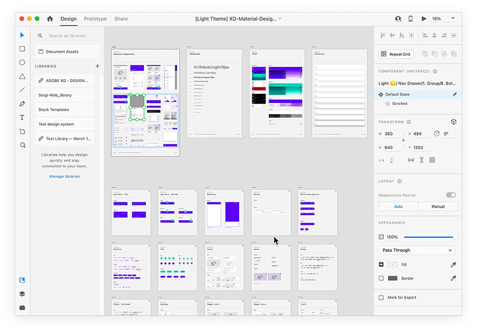

import Container from "../../components/Container.astro";
import StyledHeading from "../../components/StyledHeading.astro";
import Columns from "../../components/Columns.astro";
import screenRecording from '../../assets/images/first-mile-journey/screen-recording.mp4';

<Container variant="muted" eyebrow="intent" title="Convert new users">
  In 2017, Adobe XD was rolled out of Beta and quickly became the go-to tool for
  UX designers. In a couple of years the tool had a long list of complex
  features added to it which made it overwhelming for new users and feature
  discovery was crowded.
   
  In 2019 I led the Growth & Engagement charter to make the first
  mile-experience smoother for new users and helping them convert to RMAUs
  through homescreen redesign, introduction of Learn Tab, feature tooltips and
  contextually triggering pro-tips. The design intervention was not limited to
  only new users but also up-skilled existing users.
   
  One of the core problems facing XD was user drop off after one week of trial.
  The requirement was to convert these users to RMAUs (Return Monthly Active
  Users) by understanding their usage patterns, pain-points and defining the
  First Mile Experience to help them become confident Adobe XD users.
</Container>

<Container variant="transparent" eyebrow="early insights" title="Piecing it together">
We  started with understanding the relationship between the product and users better by:
 
- observing new users - from installing XD to saving their first project,
- connecting with existing users to understand their workflows, and
- delving into analytics of both user types to learn usage patterns

 

##### Existing Homescreen

<Columns columns={3}>
  

    ###### Hot spots
    - 98% users start with a preset
    - First time users begin with Get Started card
    - Other items on homescreen ~ 2% click rate
  

  
  

    ###### Learn tab 
    - Majority of users didn’t notice entry-point. 
    - ~ 1% of users clicked Learn. 
    - It’s an external link, fragmented UX, not in-app.
  

  

    ###### Tutorial project 
    - 20% of new users did open tutorial file. 
    - Only one tutorial file with no variety. 
    - Need varied projects to learn specific tools.
  

</Columns>

 
##### Existing In-app help
<Columns columns={2}>
  

    ###### Onboarding 
    - Most first time users didn’t complete tour. 
    - Users wanted to access tour later, but finding it was complex 
    - List of coachmarks grew with each feature release.
  

  

    ###### Coachmarks 
    - Coachmarks appeared randomly. Not contextual. Too many.
    - 99% users closed coachmarks instead of ‘Know more’. 
    - Became a blind spot for users
  

</Columns>

 

</Container>

<Container variant="muted" eyebrow="discovery" title="No Unsolicited advice">
  

    - **Create vs Learn Mode:** All customers use XD for creation. When they
    were creating they didn’t want to learn. They would learn during their free
    time.
     
    - **Tutorial projects should cater to user expertise:** The existing
    tutorial project was a generic project which gave users an overview of XD.
    But users had different proficienncy levels and understanding of tools, they
    needed tutorial files that suited their expertise level.
     
    - **Auto coachmarks=visible blindspots:** Appearance of auto-actuated
    coach-marks while they were engrossed in their work didn’t help them at all.
    Hence, they would always invariably close them.
     
    - **Not contextual:** Also, none of the coachmarks were contextual. Showing
    a coachmark about creating artboards while the user is creating a component
    failed to capture their attention at all.
     
    - **No in-app learn:** The learn tab opened in an external browser and
    took users outside XD. Moreover, if users had to go out of the tool, they
    would open other blogs & youtube videos and get distracted.
  

</Container>

<Container variant="transparent" eyebrow="role" title="Prioritize user needs">
What started as a UI update project soon showed there are deeper problems that could not be solved by just redesigning the home-screen. It involved content, rather a lack of it, and when & how we were showing that content to the users.
 
To solve the First Mile Experience we needed to look at the initial experience of the user in a more holistic way. This meant not just looking at the home-screen with a fresh outlook but also define the in-app experience of new users. This also meant that we needed to make sure we extended this help to up-skill existing users as RMAUs actually meant both new and old users. And a return user base can be sustained only if we up-skilled all users to be XD experts by making our new features more discoverable and making sure tey use these tools to enhance their productivity.

 
##### Homescreen evolution

<Columns columns={3}>
  

  ###### Prioritise & Declutter
  Make the homescreen more intentional. Since users need create new projects and open recent projects. Highlight them!
    
  ###### Multiple Tutorials:
  Add multiple tutorial projects. Make tutorial projects varied and fun. Also, use them as a way to highlight

###### Learn tab:

Make the learn tab more prominent. Bring the learn-tab inside the homescreen instead of external browser.

  

  

 
  

</Columns>

 

<Columns columns={3}>
  

  <video autoplay loop muted playsinline width="100%">
    <source src={screenRecording} type="video/mp4" />
  </video>
  

  

  ###### In-App
  ###### Featured tooltips:
  Remove coachmarks. Let the user initiate rich tooltips when they want to learn about a particular tool/feature.
    
  ###### Contextual tips:
  Trigger non-intrusive contextual learn content based on user action.
  

</Columns>

</Container>

<Container variant="muted" eyebrow="design" title="Context defines content">
  

    - **Create vs Learn Mode:** All customers use XD for creation. When they were creating they didn’t want to learn. They would learn during their free time.
     
    - **Tutorial projects should cater to user expertise:** The existing tutorial project was a generic project which gave users an overview of  XD. But users had different proficienncy levels and understanding of tools, they needed tutorial files that suited their expertise level.
     
    - **Auto coachmarks=visible blindspots:** Appearance of auto-actuated coach-marks while they were engrossed in their work didn’t help them at all. Hence, they would always invariably close them.
     
    - **Not contextual:** Also, none of the coachmarks were contextual. Showing a coachmark about creating artboards while the user is creating a component failed to capture their attention at all.
     
    - **No in-app learn:** The learn tab opened in an external browser and took users outside XD. Moreover, if users had to go out of the tool, they would open other blogs & youtube videos and get distracted.
  

</Container>

