import Container from "../../components/Container.astro";
import StyledHeading from "../../components/StyledHeading.astro";
import Columns from "../../components/Columns.astro";
import StyledText from "../../components/StyledText.astro";
import MdxImage from "../../components/CustomUI/MdxImage.astro";

<MdxImage 
  src={import('../../assets/images/single-window-booking/single-window-booking.png')} 
  alt="Description"
  class="absolute top-0 left-0 -z-10 w-full mx-auto rounded-md"
/>
<figcaption class="mt-90 mb-15 text-center italic text-sm text-gray-600 mt-2">
              Single window bookig system for in-counter ticketing
            </figcaption>

<Container variant="muted" eyebrow="challenge" title="Put efficiency at the core of the system">

redBus is the world’s largest bus-ticketing platform. They have their own website and app that users book their bus ticket from. But in redBus’ new markets like Singapore, Malaysia, and Indonesia the biggest chunk (>90% of all bookings) of tickets are sold by Bus Operator Counters and Direct Agents through our B2B website redPro sell. The large Bus Operators book upwards of 100 tickets a day through this platform.
 
The existing booking funnel is a replica of the B2C booking channel of redbus.in. It was not designed for such heavy usage. A new system which could help the counter operator book tickets in a easy to use environment at a much faster pace was iperative. Designing an efficient system with optimised work flows was the challenge.

 

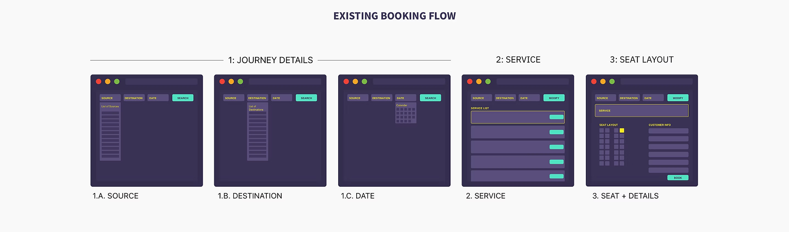

</Container>

<Container variant="transparent" eyebrow="role"  title="Enabling the product">
I led the redesign-project and was responsible for the benchmarking, user research, product scoping, system architecture, defining the flows and experience, laying down the visual design guidelines, content, prototyping and testing. Effort was concentrated on finding out the capabilities of the product and enabling it to accomplish what it was expected and intended to perform. 
 
The first phase was completed within 4 weeks and the second and final phase which accomodated all the changes from the MVP usage pattern and testing another 7 weeks.
</Container>

<Container variant="muted" eyebrow="goal"  title="Optimize counter bookings">
The existing B2B website struggled to scale at the same pace our business in these countries were expanding. Basic usability was a challenge. The counter operatives had to book hundreds of tickets within a couple of hours during the peak demand periods. A breaking UI and a chaotic crowd queuing up to buy their tickets was making life harder for the person at the counter.
 
We identified that booking a ticket was the most frequent and laborious job for them. A need to optimise the counter booking experience was imperative.
 
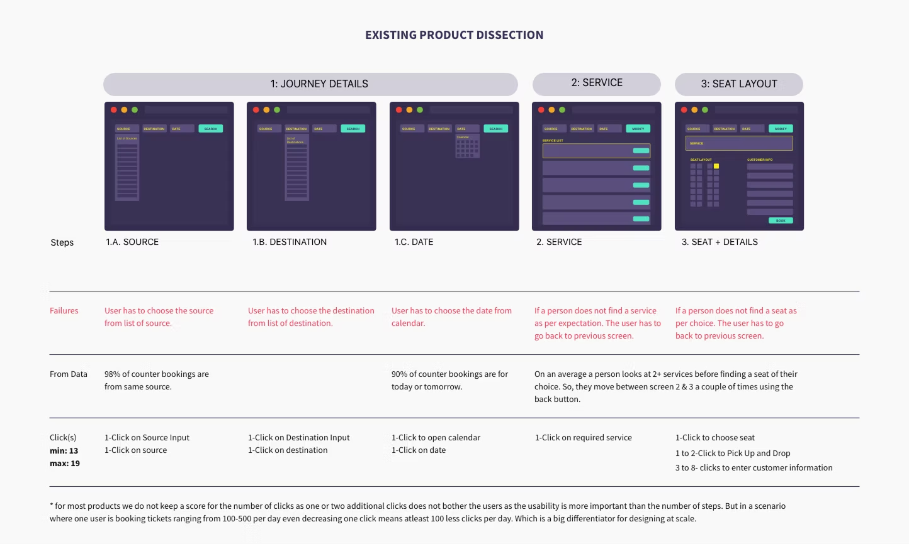

</Container>

<Container variant="transparent" eyebrow="research"  title="User expectation recognition">
When I set out to spend time with primary users the main goal was to understand the environment the user was working in. Factors like user goals, physical environment, work pressure, customer interaction and interface know-how was documented and quantified into relevant packets.
 
The users had a queue of impatient passengers by the hundreds in front of them during peak hours. They had an extremely volatile environment and needed to cater to customer requests quickly.  Also, most of the operators were not well trained and needed to learn the interface on the job.
 
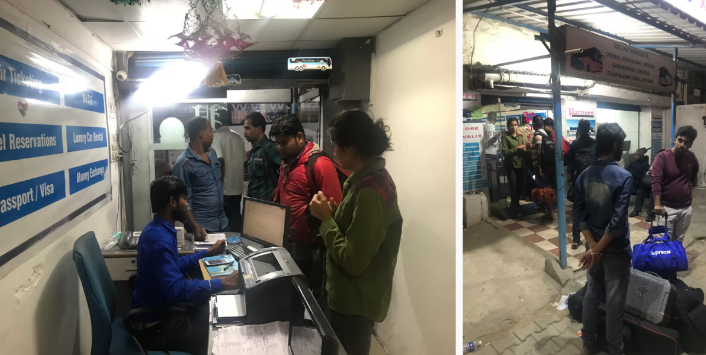
</Container>

<Container variant="muted" eyebrow="user insights"  title="User expectation has evolved over time">
With the rapid upgradation of digital technologies in the form of facebook, whatsapp, instagram, youtube etc. people using our old system have outgrown it. They have adapted to new technology at a much faster rate than we envisioned. While earlier our product concentrated on getting the work done. Now the users wanted the work to be done fast and with flair. 
 
In short, the people who used our system for their business needs had started looking at our system now as a reflection of their business. Their expectations from the product had heightened along with increasing business complexities over the years
</Container>

<Container variant="transparent" eyebrow="product insight"  title="Booking is the mainstay">
The insights from the primary research and the feedback from the Task Analysis revealed the finer points in the booking flow and the usage pattern.
 
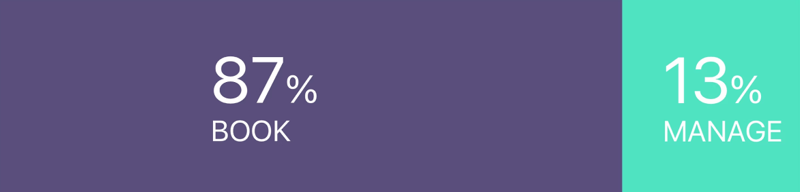
 
Apart from booking a ticket as per customer inflow/ demand, it was noted that many other tasks were performed at a service level on a daily basis. Some of these tasks were already clubbed with the existing booking flow but we went back to the drawing board and identified all the probable tasks that could be used frequently, viz.:
 
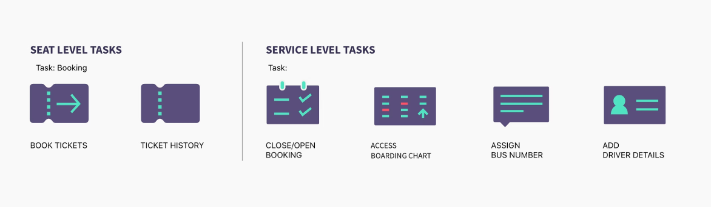
</Container>

<Container variant="muted">
<StyledText class="max-w-3xl mx-auto">
Thus, the booking flow transformed from a Single Window Booking to Single Window Task-manager Page.
</StyledText>
</Container>

<Container variant="transparent" eyebrow="value adding goals"  title="Accessible daily tasks">
As discussed above we identified tasks that were performed on a daily basis by the operators. These tasks were clubbed with the booking flow to make the experience more than just about booking but a single window to carry out all the frequent tasks of the bus operator. While a plethora of actionable items was accomodated, the booking flow was at the core of the design.
</Container>

<Container variant="muted" eyebrow="vision"  title="Tap/Tab to book">
We looked at how we could optimise the booking flow in terms of time saved in learning to use the product to the time spent in using the product. Our high level vision was to:

1. Make the whole operation tap (or click) friendly,
2. For heavy keyboard users make it receptive to tab, arrows and enter keys,
3. Reduce the learning curve and make it easy to use by anyone,
4. Make a platform with quick navigation and deeper engagement.

 
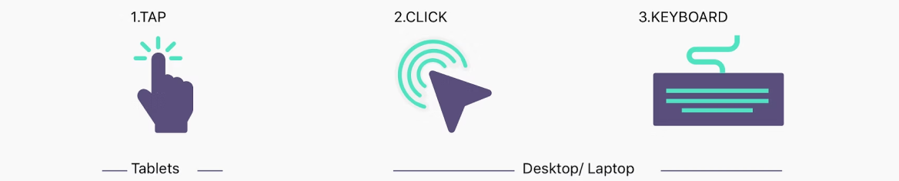

</Container>

<Container variant="transparent" eyebrow="user insights"  title="It’s not a page. It’s a system">
At the onset of the project the problem statement was described, by all the stakeholders involved, as redesigning a booking page for Bus Operators. But our research revealed that it as a rejig of the entire system around a bus viz: editing certain parameters of the service, assigning drivers and buses, downloading boarding charts, overriding fares etc. along with booking tickets. 
 
The early question of ‘How can we design a fast booking experience?’ had now changed to:
</Container>

<Container variant="transparent">
<StyledText class="max-w-4xl mx-auto">
‘How can we design an experience to book tickets and manage a service until it departs a much faster process?’
</StyledText>
</Container>

<Container variant="muted" eyebrow="user insights"  title="User expectation has evolved over time">
After several iterations and feedback from stakeholders task hierarchy for the users was defined with contextual goals thereby making each task more focused and simple enough to be performed by even first time users.

Based on usage pattern and frequency the IA was divided into two distinct parts:

1. Search/Retrieve: Route, Date and Service Listing
2. Action:

a. Manage-Assigning Drivers, Bus Numbers, Boarding Charts etc.
b. Book-Choosing a seat and entering Passenger Details.
c. Ticket Details-Edit Passenger Details, Cancel or Reschedule.

This helped in future proofing the product as any new demand could be accommodated in one of the existing blocks or introduction of a new block thereby making it highly scalable.
 
Multiple layouts were made with these components to achieve a simple layout.
 
Two wireframes were zeroed in after a series of iterations and taken forward for discussions with the stakeholders. The vertical layout won hands down against the horizontal layout. The flow was linear and had a faster response time. It also required the least amount or no training for the users. Hence it was chosen and the final layout and work flows were tested.
 
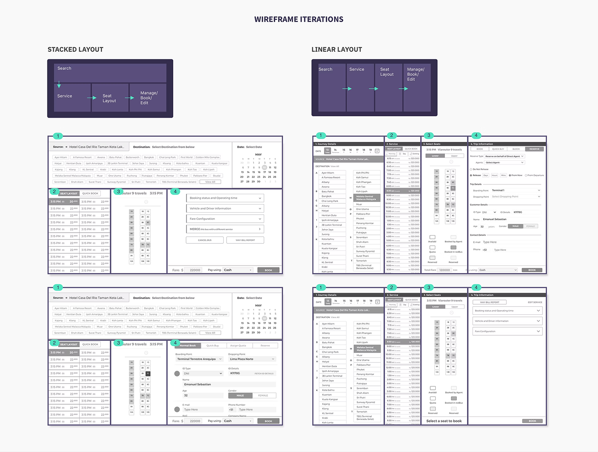
 
After multiple iterations with three stages of user testing and validation, the final booking flow was frozen.
 
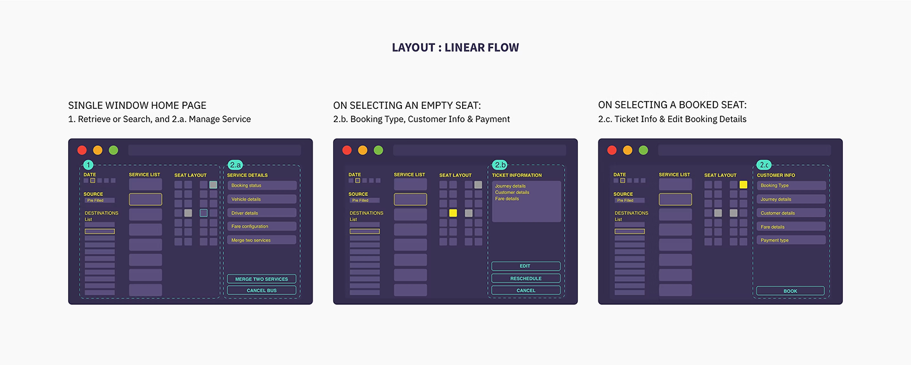
Quantitative and qualitative breakdown of the design.
 
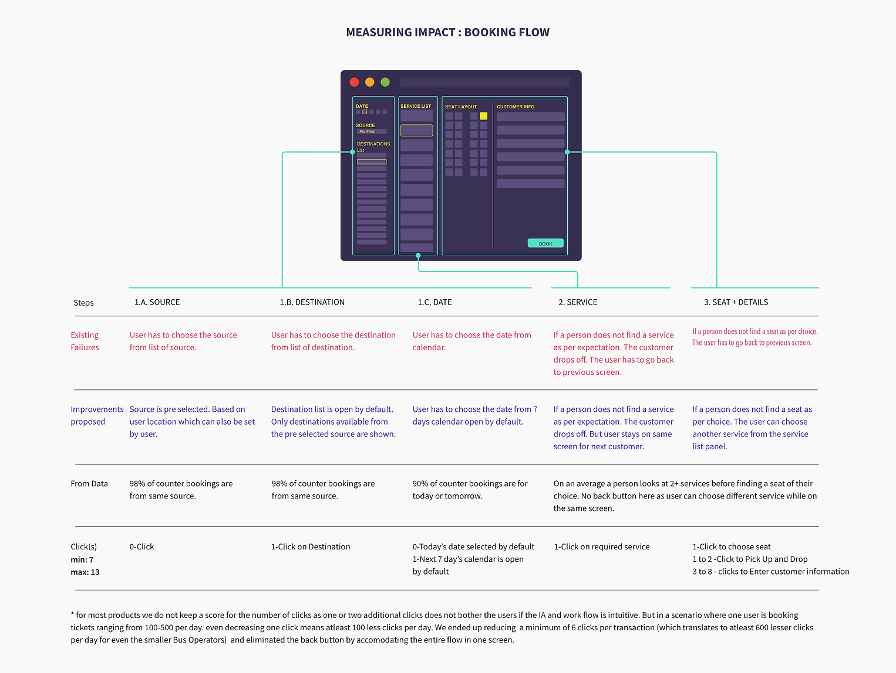
</Container>

<Container variant="transparent" eyebrow="final designs"  title="Accessible. Scalable">
After the final wireframes were rendered I started working on the UI Design of the platform. The entire webpage is divided into four panels. First two panels focuses on selection of date, source, destination and services. Thethird panel shows the seat layout while the fourth panel is where most of the action ranging from service edit to booking takes place. All the actionable items were divided into components in the form of cards to complete different actions of Managing Services.
 

 
*Step 1: Service Detail Page*
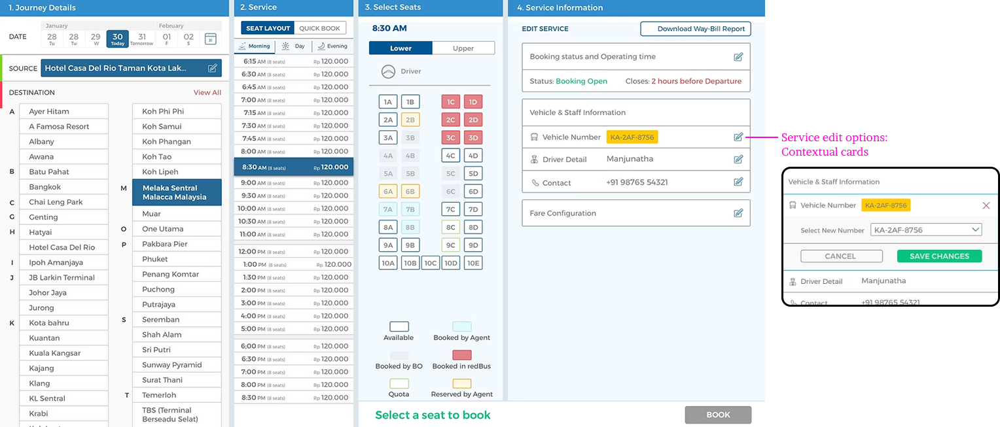
 
*Step 2: Booking Page*
On selecting an available seat
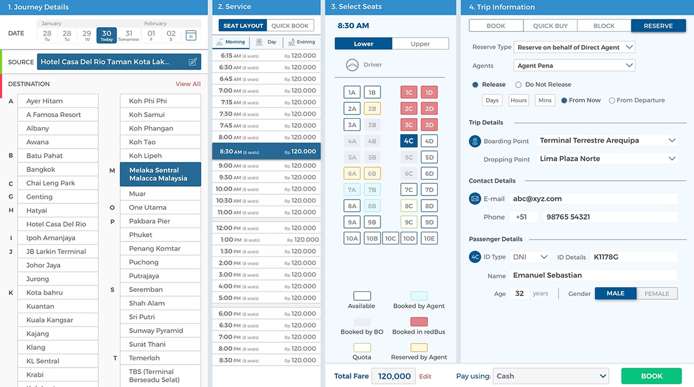
 
*Step 3: Ticket Detail Page*
On selecting a booked seat

</Container>

<Container variant="muted" eyebrow="impact"  title="Overwhelming adaption">
Before the new designe was launched in October 2018, our top 5 bus operator in Malaysia and Singapore used to book an average of 100 tickets per day through the system. After the introduction of the new design the bookings have soared to 500+ tickets per day within that month itself. This has enabled us to get more Bus Operators partner us for a faster, simpler and delightful user experience.
</Container>

<Container variant="transparent" eyebrow="learning"  title="Design with the user. Not for the user.">
The design approach taken at the start of the project has had a great impact on the final outcome of the product. The on field user research and the iterative process followed with a constant user feedback loop helped us mitigate failures in every step of the product. The minimum functional UI was also the result of user testing. Making the user a vital part of the design process has helped us mitigate ambiguity within our internal cross functional team and has helped the designers get stakeholders' buy-in quickly. The five fold rise in the usage with the introduction of the new design is testimony of the fact that we should not just design for the users but design with them.
</Container>