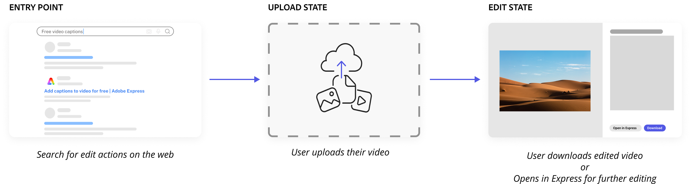
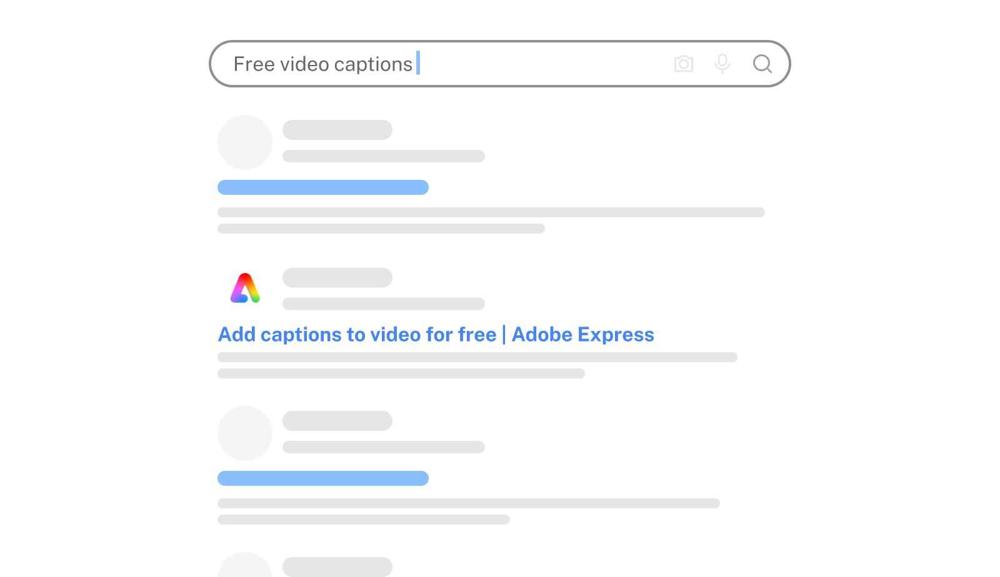
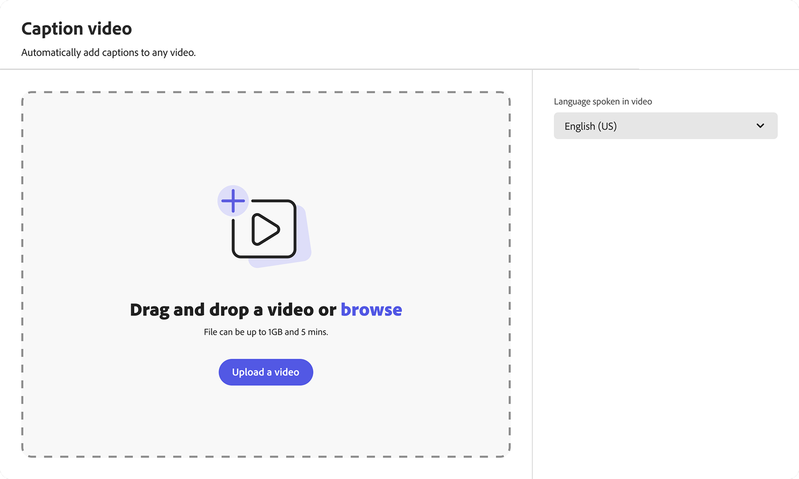
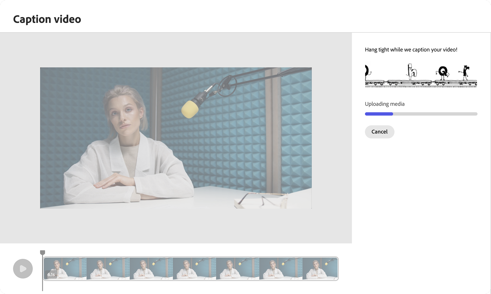
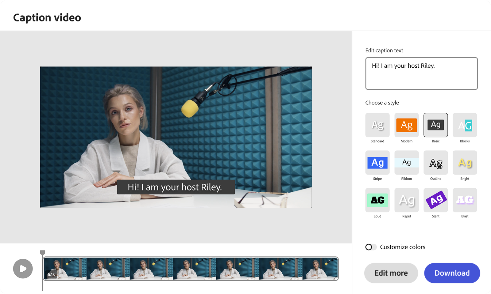
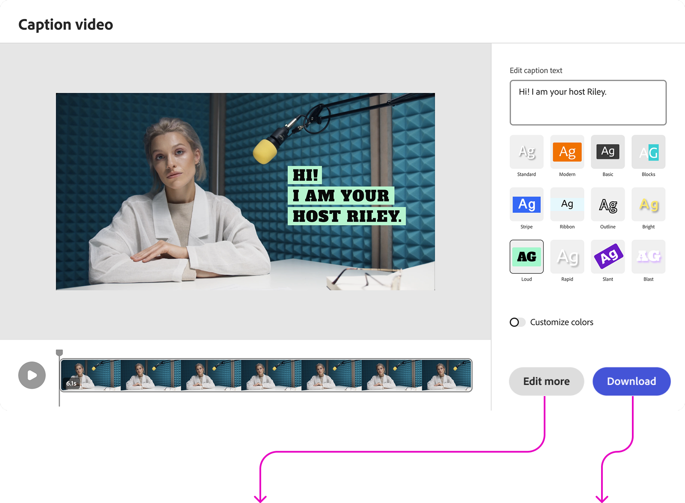
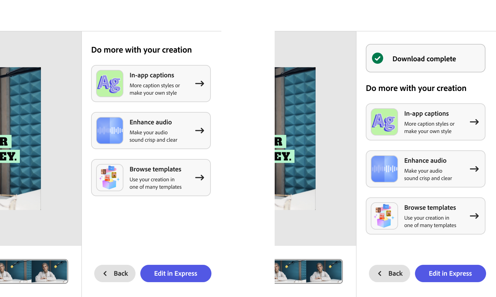

import Container from "../../components/Container.astro";
import StyledHeading from "../../components/StyledHeading.astro";
import Columns from "../../components/Columns.astro";
import H3 from "../../components/CustomUI/H3.astro";
import H6 from "../../components/CustomUI/H6.astro";
import MdxImage from "../../components/CustomUI/MdxImage.astro";
import H4 from "../../components/CustomUI/H4.astro";

<MdxImage 
  src={import('../../assets/images/video-quick-actions/video-quick-actions.png')} 
  alt="Description"
  class="max-w-5xl mx-auto rounded-md"
/>
<figcaption class="text-center mb-15 italic text-sm text-gray-600 mt-2">
              List of Video Quick Actions users can use for free
            </figcaption>

<Container variant="muted" eyebrow="goal" title="Focussed editing workflows">

 Editing video or audio often felt complex and intimidating—for both new users and the Express ecosystem. Quick Actions was created to bridge that gap: a set of streamlined, single-task workflows that made editing approachable and fast. By surfacing Express’ core video capabilities in a lightweight, focused way, users could experiment, learn, and achieve quick wins without diving into a full editor.
This initiative not only helped users discover the depth of Express but also offered a pathway to conversion, turning quick edits into long-term engagement.
  
 Video/audio editing posed problems for both users and Express’ end.

<Columns columns={2}>

###### Customer wants:
- instant editing without having to login
- a way to try out the tools before committing to it
- hand holding with video edit tools
- focussed workflows for video edits without being overwhelmed by complex editor workspaces.

###### Business needs:
- make editing tools more discoverable
- drive conversion through stand-alone workflows
- scalable surface to try out new tools
- gather feedback on nascent tools before they make it to the editor

</Columns>
</Container>

<Container variant="transparent" eyebrow="role" title="ship. future proof.">
    

        I led the Video Quick Actions workflow & framework designs. I worked with 2 Product Managers, and two Engineering Teams spread across two geographies. I also worked in parallel to the Image Quick Action design team to define the overall Quick Action framework.
         
        I worked on Video Quick Actions for 2 years where we updated the framework twice, reworked on the workflows multiple times to constantly make the experience efficient and thereby quick with each iteration. I was responsible for creating individual quick actions which let users edit quickly to gathering feedback to defining the experience in the editor.
    

        <Columns columns={3}>
            

            <H4 class="mb-5">Framework</H4>
            ###### 
            Collaborate website and Image Quick Action teams to define the Video Quick Actions framework.

            

            

            <H4 class="mb-5">E2E workflow</H4>
            ######
            Get leadership buy-ins and Design the E2E workflow for each tool and final sign off after multiple design crits.

            

            

            <H4 class="mb-5">Insights + Next steps</H4>
            ######
            Work with the PMs to gather user feedback to further refine the workflows & define Next Best Steps.

        

        </Columns>
</Container>

<Container variant="muted" eyebrow="context" title="get the job done, quickly.">
    

    Quick actions are lightweight, purpose driven editing workflows that allow users to perform focused creative tasks like removing a background, trimming a video, resizing aspect ratio, or merging clips, etc. in just a few clicks. They’re designed as standalone, zero-friction entry points into Express that don’t require sign-in, offering instant value and enabling users to experience the power of Adobe’s creative tools without commitment.
     
    Quick Actions embody the principle of “progressive engagement” that lets users start small, succeed quickly, and naturally deepen their usage over time.
    

    <Columns columns={5}>
        

        <H6> Discoverability </H6>

        Surface high-value workflows that were previously buried under multi-step editing interfaces.

        

        

        ###### Low entry barrier
        
        Lower barriers to creation for new and non-professional users.

        

        

        ###### Instant delight
        Instant gratification through successful micro-tasks that build user confidence.

        

        

        ###### Showcase capabilities
        Demonstrate editing capabilities upfront, followed by the Next Best Steps driving users to explore more.

        

        

        ###### Conversion
        
        On completion of the tasks users can open the file in Express to do more, explore and convert into Express users.

        

    </Columns>
</Container>
<Container variant="transparent" eyebrow="customer journey" title="discover + delight = commit">
    

        Each Quick Action follows a guided, single-purpose flow optimized for speed and clarity:

        <ol class="list list-decimal list-inside text-base space-y-1">
        <li>**Entry Point:** User discovers Quick Actions via search, or Express home.</li>
        <li>**Upload State:** User adds an input file (image, video, or document).</li>
        <li>**Edit State:** AI-powered backend performs the operation instantly.</li>
        <ul class="list list-disc list-inside ml-6 mt-1 space-y-1">
                <li>**Automated Processing:** AI-powered backend performs the operation instantly.</li>
                <li>**Preview & Adjust:** Minimal editing interface allows for quick refinements.</li>
                <li>**Download or Continue in Express:** User can download the result or move seamlessly into full Express for advanced editing.</li>
            </ul>
        </ol>
         
        Quick Action workflow emphasizes discoverability, speed, and predictability for users. A user’s journey into Adobe Express starts at the completion of their Quick Action task.
        
        
    

     
    

        

</Container>

<Container variant="muted" eyebrow="walkthrough" title="do. show. nudge.">

*Quick Actions help users complete tasks faster and helps convert prospective users to Adobe Express.*

 
 
 
<Columns columns={3}  borderDot={true} dotTitle="Search for edit tools">
  

   
    <ul class="list list-disc text-md">
    - Users look for video edit tools
    - Keywords: video, free, quick, edits, etc.
    - Eg: Video Captions
    </ul>
  

  

    
  

</Columns>

<Columns columns={3} borderDot dotTitle="Search results">
    

     
    <ul class="list list-disc text-md">
    - SEO optimisation helps show Adobe Express Quick Actions
    - Eg: Captions | Adobe Express
    </ul>
    

    

        
    

</Columns>

<Columns columns={3} borderDot dotTitle="Open Video Quick Action">
    

     
    <ul class="list list-disc text-md">
    - Land on the Quick Actions page
    - Upload video(s)
    </ul>
    

    

        
    

</Columns>

<Columns columns={3} borderDot dotTitle="Automated processing">
    

     
    <ul class="list list-disc text-md">
    - AI powered backend completes action
    </ul>
    

    
    

        
    

</Columns>

<Columns columns={3} borderDot dotTitle="Actions based on content">
    

      
    <ul class="list list-disc text-md">
    
    - The style of the caption is auto-chosen as per the uploaded content type and colours.
    - Even the placement of the captions is content aware.
    </ul>
    

    

        
    

</Columns>

<Columns columns={3} borderDot dotTitle="Task completed">
    

     
    <ul class="list list-dsisc text-md">
    - User can choose to Download their work or click on ‘Next steps’
    </ul>
    

    

        
    

</Columns>
<Columns columns={3} borderDot dotOnly dotTitle="Next steps">
    

     
    <ul class="list list-disc text-md">
    - With either CTA, they are shown contextual actions linked to their current work which lead them to open their project in Adobe Express.
    </ul>
    

    

        
    

</Columns>
</Container>

<Container variant="transparent" eyebrow="learnings" title="show. don't tell.">
    

    The fact that quick actions are available for free helps new users discover Express and complete their editing tasks quickly. And a quick action’s success helps Express convert new users.
    
     
Auto Captions is the most used VQA - NUMBERS?
Animate from Audio is the next most used VQA - NUMBERS?
Conversion of new users into Express - NUMBERS
Conversion to paid users.
    

</Container>